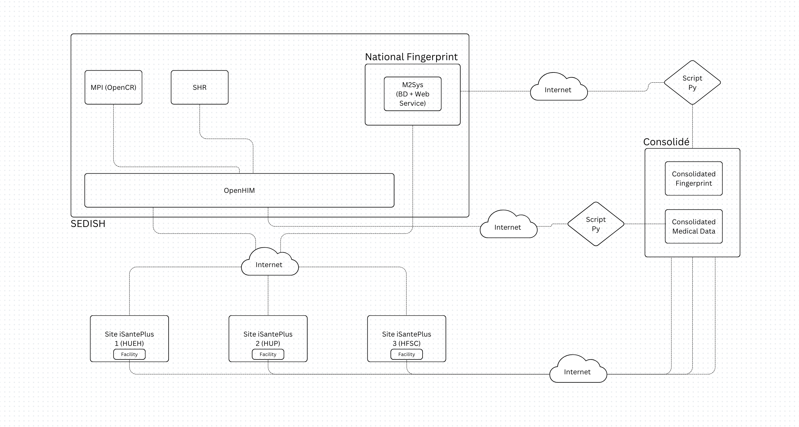

# openmrs-fhir-sqlmesh

Maps the **CHARESS consolidated OpenMRS database → FHIR R4** with **SQLMesh**, and
loads it into SEDISH's **OpenCR (MPI)** and **SHR**. In the Roaming Care architecture
this repo is the **"Script Py"** between the *Consolidé* server and *SEDISH* — it turns
consolidated medical data into FHIR and pushes it through OpenHIM.

## Where it fits



Reading the whiteboard left-to-right:

- **Sites iSantePlus (HUEH, HUP, HFSCJ, …)** — the EMRs at each facility. Every site is
  identified by its **`mspp_code`**.
- **Consolidé** — the consolidated server. It continuously ingests each site's OpenMRS
  data (CDC over the MySQL binlog) into one **`consolidated_db`** (*Consolidated Medical
  Data*), and holds biometric fingerprints (*Consolidated Fingerprint*).
- **This repo (the ETL / "Script Py")** — reads `consolidated_db`, maps it to FHIR, and
  delivers it to SEDISH over OpenHIM:
  - **Identity → OpenCR (MPI):** Patients, with their per-site MRNs and the national
    fingerprint id. **OpenCR does the de-duplication / cross-site linking**, not us.
  - **Clinical → SHR:** Encounters + Observations as a transaction Bundle.
- **SEDISH** — **OpenHIM** is the front door (channels `/CR/fhir` and `/SHR/fhir`);
  **OpenCR** is the client registry / MPI; **SHR** is the shared health record (HAPI FHIR).

```
 Site 1 ┐
 Site 2 ┤── CDC ──▶  Consolidé: consolidated_db ──▶  [ openmrs-fhir-sqlmesh ]
 Site N ┘            (OpenMRS-shaped, multi-site)        │ 1. transform (SQLMesh)
                                                         │     consolidated_db → fhir.patient/encounter/observation
                                                         │ 2. load (loader/)
                                                         ▼
                                              OpenHIM ──┬─▶ /CR/fhir  → OpenCR (identity, dedup, golden records)
                                                        └─▶ /SHR/fhir → SHR → HAPI FHIR (clinical)
```

### What's in this repo, and what isn't
- **In scope:** the *transform* (SQLMesh models → FHIR) and the *load* (`loader/`).
- **Out of scope:** the *extract* — getting site data into `consolidated_db` is the
  Consolidé server's job (binlog CDC). This repo treats `consolidated_db` as a read-only source.

## Why a single multi-site DB needs an MPI

Each site keeps its own patient ids, so the same person appears under different MRNs at
different facilities. We don't try to resolve that here — we attach every identifier we
have (per-site MRN + national fingerprint id) and let **OpenCR** decide. The national
fingerprint id (`HT-…`, statut `UNIQUE`/`DOUBLON`) is the strong cross-site key: a
`DOUBLON` reuses the canonical id, so the same person at two facilities collapses to **one
golden record** in OpenCR, and the SHR re-points all their clinical data onto it.

## Use it in a SEDISH setup

**Prerequisites**
- Network reach to the Consolidé `consolidated_db` (read-only) **and** to OpenHIM (`:5001`).
- A **writable** MySQL/schema for SQLMesh to materialize outputs + state into.
- OpenHIM channels `/CR/fhir` (→ OpenCR) and `/SHR/fhir` (→ SHR) configured, with client creds.

**1. Configure**
```bash
cp config.template.yaml config.yaml      # git-ignored; fill in connection + creds
uv sync                                  # or: pip install -e .
```
- `connection` → the Consolidé `consolidated_db` (read) + your writable output db (`digi_fhir`).
- `variables.national_id_system` → the FHIR system URI OpenCR expects for the fingerprint id.

**2. Transform — build the FHIR**
```bash
sqlmesh plan --auto-apply     # materializes fhir.patient / fhir.encounter / fhir.observation
sqlmesh test                  # unit tests (against test_connection)
```

**3. Load — push to OpenCR + SHR through OpenHIM**
```bash
# points at the fhir.* views from step 2 and the OpenHIM channels (env-configurable)
FHIR_DB_HOST=<output-mysql> OPENCR_URL=http://openhim-core:5001/CR/fhir \
SHR_URL=http://openhim-core:5001/SHR/fhir \
python loader/push_to_openhim.py          # add DRY_RUN=1 to preview without writing
```
The loader is **idempotent** (PUT by uuid) so it's safe to re-run. Defaults match a stock
SEDISH swarm (`openhim-core:5001`, clients `openshr` / `shr-pipeline`); override via env.

**4. Schedule** — run steps 2–3 on a timer (cron / SQLMesh scheduler). Switch the models
from `FULL` to `INCREMENTAL_BY_*` (keyed on `date_changed`) for production volumes so each
run only processes changed rows.

**5. Verify**
```bash
# identity: the two facilities' records for one person share ONE golden record
curl -su openshr:openshr 'http://openhim-core:5001/CR/fhir/Patient?identifier=<national-id>'
# clinical: the encounters/observations landed (SHR normalizes subject → golden record)
curl -s 'http://hapi-fhir:8080/fhir/Encounter/<uuid>'
```

### Verified end-to-end behaviour
Against a SEDISH stack (two+ sites in `consolidated_db`): two source patients at different
facilities sharing one national fingerprint id collapsed to a **single OpenCR golden
record**, a patient with no fingerprint id stayed **separate**, and **all** their
Encounters/Observations persisted in HAPI with `subject` re-pointed onto the golden record
— i.e. one unified cross-facility record, which is the point of the HIE.

## Mapping rules encoded (per the CHARESS spec)
- Composite key **`(mspp_code, patient_id)`**; `person_id = patient_id`; `voided` filtered; `preferred=1` first.
- Resource id = OpenMRS `uuid`; `gender` accepts code or label (`M`/`Male`→`male`).
- Per-site MRNs → `Patient.identifier` via `ref.identifier_systems` (systems must match OpenCR's `internalid`).
- `national_id` attached only for `statut ∈ {UNIQUE, DOUBLON}`; **DOUBLON reuses the shared id**.
- `obs` → `Observation` (`value[x]` by type, `concept_name` label); dateTimes T-separated.

## Layout
```
config.template.yaml   gateways (mysql connection + test_connection), FHIR-system variables
external_models.yaml   typed schemas of the consolidated_db source tables (read live)
models/fhir/           the mapping: patient.sql, encounter.sql, observation.sql  (→ FHIR JSON)
models/ref_*           reference mappings (identifier_type → FHIR system), SEED
loader/                push_to_openhim.py — load fhir.* into OpenCR (/CR) + SHR (/SHR)
audits/                data assertions (e.g. every Patient has an identifier)
tests/<domain>/        SQLMesh unit tests by domain (patient / encounter / observation)
documentation/domains/ per-resource mapping notes
docs/architecture.png  the Roaming Care / SEDISH architecture
schema/                the real consolidated_db DDL dump (authoritative source reference)
```

## Status & open items
Transform + load verified end-to-end on MySQL against the real schema. Pending — all
gated on data CHARESS still owes, not on the pipeline:
- **`national_fingerprint_mapping` not in the dump** — identity/DOUBLON core wired + tested via fixtures, inert until delivered.
- **No `concept_reference_*`** → Observations use `concept_name` labels + local code (no CIEL codings yet).
- **Dimension tables data-less** (`patient_identifier_type`, `encounter_type`, `site`, visit-type) — need the rows to finalize identifier systems / `Encounter.type`.
- **iSantePlus domain tables are derived denormalizations** (incl. `patient_isanteplus`, declared as a source) — publish canonical `obs`/`encounter`, not these (avoid double-counting).
- **Incremental kind:** models are `FULL` for now; move to `INCREMENTAL_BY_*` for production volumes.
